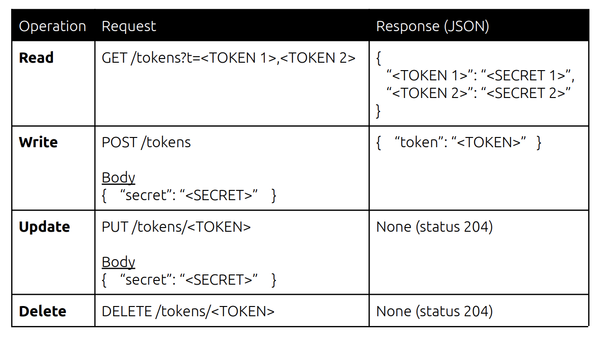

# tokenService

## Assignment:

### Introduction
One of the hardest parts of building a secrets manager is building trust. Trust comes in
many forms: the security of the product, the actual* availability of the service, the
entire user experience. One of the ways we secure data is through tokenization, which
ensures our databases do not have direct access to our customer’s sensitive data.
For this project, we would like to build an internal tokenization service. This service will
only be exposed to our internal network and will be used by our other
(internet-accessible) services. This tokenization service will support 4 operations: read,
write, update, and delete.

### Prerequisites
Hardware & Software:

● Golang

● Computer with any text editor installed (we primarily use VSCode)

● Push your code to Github or Gitlab

### Requirements
Build a web service that supports the following operations:

### Encryption/Decryption
Please use AES-256-GCM to encrypt/decrypt the secrets.

### Token Format
dp.token.RANDOM STRING

### Storage
In the interest of time, you can store all data in-memory. It does not need to persist
across application restarts. You should assume that the storage layer requires
asynchronous IO.

### Security
Please think through the possible threat vectors to future proof the service against
attacks. This is meant to be open ended, as we care about seeing which attack vectors
you think are the highest priority and how you mitigate them. Jot down some initial,
high-level ideas so that we can discuss further.

## Makefile Commands:
### Build
`make build`

### Run
`make run`

### Help
`make help`

### Testing
`make test`

## Optional Flags
### PORT
-p, -port <Port_including_:>
